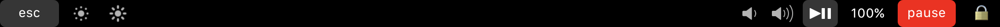

# Touchbar Zeittracker
## Einrichtung
### Was ihr braucht:
Dieses wundervolle Projekt namens [MTMR](https://github.com/Toxblh/MTMR)
Und das config file aus meiner Repo (dafür hab ich nen mini installer geschrieben)

### Installation:

1. MTMR kann ganz einfach mit brew installiert werden `brew install --cask mtmr`
2. MTMR starten und Sicherheitsfreigaben für Automatisierung ersteilen
3. Die Repo hier klonen `git clone git@github.com:derfryday/touchbar_time_tracking.git` und das `install.sh` file ausführen. Das Passwort wird im code gehashed und nur der Hash wird gespeichert.

status url ist die URL zu der Smalltime startseite

tracking url ist die URL zu der `track_time.php` datei

## Layout

## Warnung
MTMR ersetzt die gesamte existierende Touchbar.
Die "alte" Touchbar ist noch da und unverändert aber nicht Aktiv, ihr müsst MTMR nur beenden wenn ihr die alte Touchbar zurück haben wollt.
Falls ihr versuchen wollte eure Änderungen zu der neuen Touchbar zu portieren empfehle ich das [MTMR Repo](https://github.com/Toxblh/MTMR) als Dokumentation.
